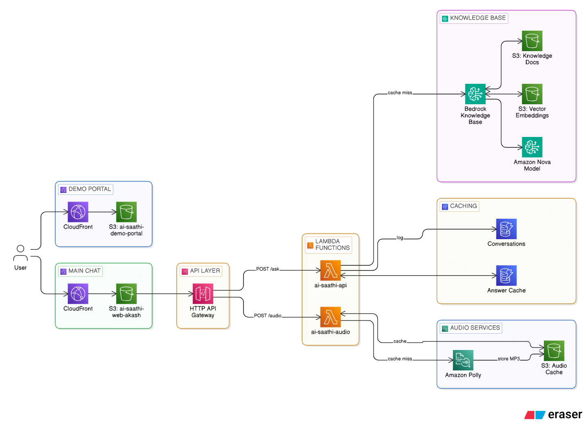

# AI Saathi - Government Scheme Information Assistant

## 🏆 Hackathon Submission
**Project Name:** AI Saathi  
**Developer:** Akash (GitHub: 75888akash)  
**Purpose:** Multilingual AI-powered assistant for Indian government schemes

## 📋 Overview
AI Saathi is an intelligent chatbot that helps Indian citizens discover and understand government schemes in Hindi and English. Built using AWS serverless architecture with Amazon Bedrock Knowledge Base, it provides accurate, cached responses with text-to-speech capabilities.

## 🏗️ Architecture

### System Components
1. **Frontend Layer**
   - Demo Portal (CloudFront + S3)
   - Main Chat Interface (CloudFront + S3)

2. **API Layer**
   - HTTP API Gateway (jg30c7c6r7)
   - Routes: POST /ask, POST /audio

3. **Compute Layer**
   - Lambda: ai-saathi-api (Python 3.12, 256MB)
   - Lambda: ai-saathi-audio (Python 3.12, 512MB)

4. **Knowledge Base**
   - Amazon Bedrock Knowledge Base (ID: 1VKMSXXJKH)
   - S3: ai-saathi-knowledge-docs (58 PDF documents)
   - Vector Embeddings: bedrock-knowledge-base-0xjz1f
   - Model: apac.amazon.nova-micro-v1:0

5. **Caching Layer**
   - DynamoDB: ai-saathi-answer-cache
   - S3: ai-saathi-audio-cache (32 MP3 files)

6. **Logging**
   - DynamoDB: ai-saathi-conversations (182 entries)

7. **Audio Services**
   - Amazon Polly (Voices: Aditi-Hindi, Joanna-English)

### Architecture Diagram


## 🚀 Features

### Core Capabilities
- ✅ Multilingual support (Hindi & English)
- ✅ Intelligent caching for faster responses
- ✅ Text-to-speech with Amazon Polly
- ✅ RAG-based answers using Bedrock Knowledge Base
- ✅ Query normalization for better cache hits
- ✅ Conversation logging
- ✅ Source document tracking

### Smart Features
- Automatic language detection
- Query validation and normalization
- Cache hit optimization
- Audio caching for repeated queries
- CORS-enabled API

## 📁 Repository Structure
```
ai-saathi-github/
├── lambda/
│   ├── ai-saathi-api/
│   │   └── lambda_function.py
│   └── ai-saathi-audio/
│       └── lambda_function.py
├── frontend/
│   ├── main-chat/
│   │   └── index.html
│   └── demo-portal/
│       ├── index.html
│       ├── about.html
│       ├── schemes.html
│       ├── apply.html
│       ├── status.html
│       ├── contact.html
│       ├── login.html
│       ├── style.css
│       ├── chatbot.js
│       └── lang-toggle.js
├── architecture/
│   └── AI_Saathi_V1.png
├── docs/
│   ├── API_DOCUMENTATION.md
│   └── DEPLOYMENT_GUIDE.md
├── infrastructure/
│   └── aws-resources.json
└── README.md
```

## 🔧 Technical Stack

### AWS Services
- **Compute:** AWS Lambda (Python 3.12)
- **API:** HTTP API Gateway
- **AI/ML:** Amazon Bedrock (Nova Micro), Bedrock Knowledge Base
- **Storage:** Amazon S3
- **Database:** Amazon DynamoDB
- **Audio:** Amazon Polly
- **CDN:** Amazon CloudFront

### Programming Languages
- Python 3.12 (Backend)
- HTML/CSS/JavaScript (Frontend)

### Key Libraries
- boto3 (AWS SDK)
- json, hashlib, re (Standard Python)

## 🎯 How It Works

### Question-Answer Flow
1. User asks question via web interface
2. API Gateway routes to ai-saathi-api Lambda
3. Lambda checks answer cache (DynamoDB)
4. If cache miss:
   - Query Bedrock Knowledge Base
   - Retrieve relevant documents from S3
   - Generate answer using Nova Micro model
   - Store in cache
5. Log conversation to DynamoDB
6. Return answer to user

### Audio Generation Flow
1. User clicks "Listen" button
2. API Gateway routes to ai-saathi-audio Lambda
3. Lambda checks audio cache (S3)
4. If cache miss:
   - Generate audio using Amazon Polly
   - Store MP3 in S3 cache
5. Return base64-encoded audio
6. Browser plays audio

## 📊 Performance Metrics
- **Cache Hit Rate:** Optimized with query normalization
- **Response Time:** <2s for cached queries
- **Knowledge Base:** 58 PDF documents
- **Conversations Logged:** 182+
- **Audio Cache:** 32 MP3 files

## 🔐 Security Features
- CORS-enabled API
- Input validation
- Query sanitization
- No hardcoded credentials
- IAM role-based access

## 🌐 Deployment

### Prerequisites
- AWS Account with appropriate permissions
- AWS CLI configured
- Python 3.12
- S3 buckets created
- DynamoDB tables created
- Bedrock Knowledge Base configured

### Quick Deploy
See [DEPLOYMENT_GUIDE.md](docs/DEPLOYMENT_GUIDE.md) for detailed instructions.

## 📖 API Documentation
See [API_DOCUMENTATION.md](docs/API_DOCUMENTATION.md) for complete API reference.

## 🎨 Frontend URLs
- **Demo Portal:** https://demo.techietech.shop (CloudFront: EWR0A4PSPJ32G)
- **Main Chat:** https://ai-saathi.techietech.shop (CloudFront: EPBY76Z26CA8D)

## 🧪 Testing
```bash
# Test main API
curl -X POST https://jg30c7c6r7.execute-api.ap-south-1.amazonaws.com/prod/ask \
  -H "Content-Type: application/json" \
  -d '{"query": "प्रधानमंत्री आवास योजना क्या है?", "language": "hi"}'

# Test audio API
curl -X POST https://jg30c7c6r7.execute-api.ap-south-1.amazonaws.com/prod/audio \
  -H "Content-Type: application/json" \
  -d '{"text": "यह एक परीक्षण है", "language": "hi"}'
```

## 📝 License
This project was developed for hackathon purposes.

## 👤 Author
**Akash**  
GitHub: [@75888akash](https://github.com/75888akash)

## 🙏 Acknowledgments
- AWS for providing cloud infrastructure
- Amazon Bedrock for AI capabilities
- Hackathon organizers for the opportunity

## 📞 Support
For technical validation or queries, please contact through GitHub.

---
**Note:** This is a hackathon prototype. For production use, additional security hardening and scalability improvements are recommended.
